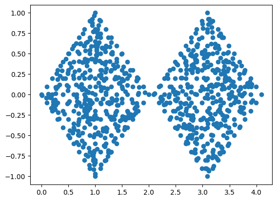
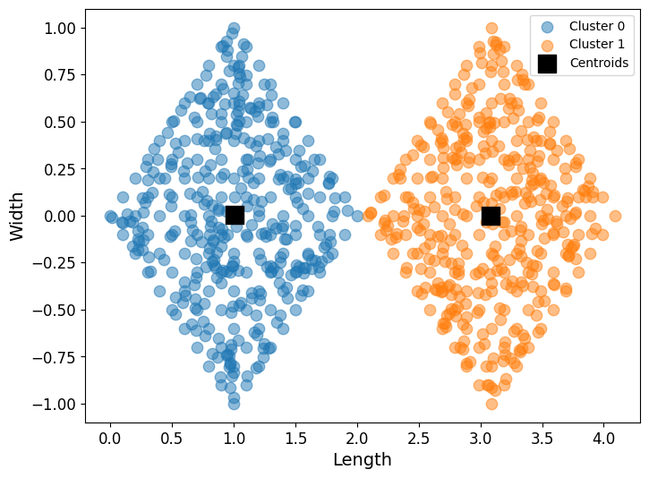
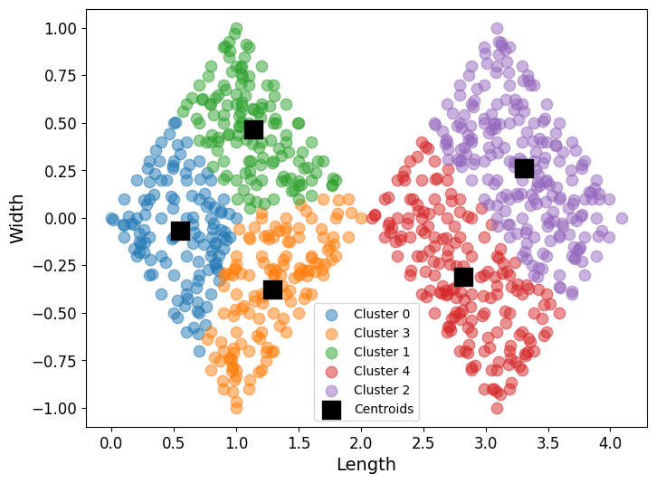
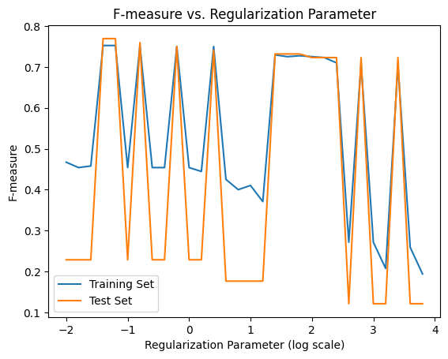
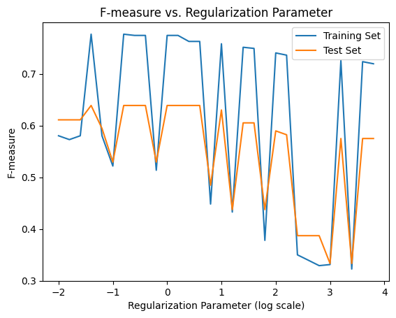

# Introduction to Artficial Intelligence

In this course I completed 5 major AI projects:
* [I wrote an a simple reflex agent and an environment for it to complete](#Simple-Reflex-Agent-and-Vacuum-Environment)
* [I desgined a traveling sales person problem envrionment and produced a hill climbing and genetic algorithm to solve the puzzle](#Hill-Climbing-and-Genetic-Algorithms-for-the-Traveling-Sales-Person-Problem)
* [I constructed a k-means clustering algorithm from scratch](#K-Means-Clustering)
* [I built from scratch a logistic regression algorithm and implemented both the regularization and standardization methods](#Logistic-Regression)
* [I wrote a naive bayes classification algorithm for a spam filter and compared it to the sci-kit learn implementation](#Naive-Bayes)

## Simple Reflex Agent and Vacuum Environment
All code for this project is in the python notebook [Vacuum Reflex Agent](Vaccum_Reflex_Agent.ipynb)

### Vacuum Environment
There are two locations or boxes an agent can be in, each box either has the status "dirty" or "clean".

### Simple Reflex Agent
An agent can perceive its current location and whether the location is dirty or not. It will then either clean the location if it is dirty or move to the opposite location if that location is clean.

### Results
 \
The performance score I used was -1 if the vacuum moved tiles, -1 if the vacuum cleans a tile and +10 if all the tiles are clean. This performance score best displays the true performance because it does not reward cleaning more squares and instead more effectively rewards completing the goal in a quick amount of time. 

## Hill Climbing and Genetic Algorithms for the Traveling Sales Person Problem
All code for the project is in the python notebook [Hill Climbing and Genetic](Hill_Climbing_And_Genetic_TSP.ipynb)

### Traveling Sales Person Environment
The Traveling Sales Person problem is the challenge of finding the shortest possible route for a sales person to visit every city on the map starting and ending at the same city. In this project I implemented a map of cities in Romania using a graph structure of nodes interconnected by edges with the cost of traversing an edge being the distance between two cities. The map is located here: \

### Hill Climbing Algorithm
The implemented hill climbing algorithm is a steepest ascent variation of the hill climbing optimization algorithm. This algorithm evaluates all the nearest neighbors from the current solution and will move in the direction of furthest improvement. A drawback of this method is that the algorithm can easily become stuck in a local maxima.

### Genetic Algorithm
The genetic algorithm is based on the ideas of natural selection from the natural world. This genetic algorithm uses a crossover and mutation function to simulate this process with the crossover function choosing which aspects of a parent solution are present in the child solution and the mutation function randomly choosing aspects of the parent solution to alter in the child solution.

### Results
#### Hill Climbing
 \
The output is the path the hill climbing implementation chose to solve the TSP and the performance cost. \
Unfortunately, the steepest ascent hill climbing algorithm got stuck in a local maxima and was unable to achieve the optimal solution.

#### Genetic
 \
Again, the output is the path the genetic algorithm took to solve the TSP and the performance cost. The performance of the genetic algorithm was much better than the hill climbing method as the genetic algorithm is more robust and less likely to get stuck in a local maxima than the hill climbing algorithm, so it found a far more optimal solution.

## K Means Clustering
All code for this project is in the python notebook [KMeans](KMeans.ipynb)

### Clustering Dataset
The dataset is located in the txt file [cluster_data](cluster_data.txt) \
The txt file is a collection of coordinate points that when graphed form two diamonds. A picture of the unclustered dataset is included below. \

### K Means Algorithm
The kmeans algorithm takes a dataset and a number of clusters in addition to a tolerance and max iterations values that have default values. The algorithm will then cluster the dataset accordingly and return both the clustered dataset and the centroid positions for each cluster. The algorithm works by randomly assigning K number of centroids, then categorizing every datapoint to the closest centroid. The centroid is then updated to the mean value of the cluster. This process is repeated until there is a negligible change in the centroids positions. For further details on the K Means algorithm refer to the included python notebook.

### Results
The clusters will vary between iterations as this is a general property of K Means algorithms. \
Clusters for K = 2: \
 \
Clusters for K = 5: \

## Logistic Regression
All code for this project is in the python notebook [LogisticRegression](LogisticRegression.ipynb)

### Regression Dataset
The dataset is located in the arff file [ckd_data](ckd_data_updated/chronic_kidney_disease_full.arff) \
This dataset contains a collection of values and observations collected by doctors and whether or not the patient had kidney disease. This dataset is used to predict if a patient has kidney disease. \
The dataset required cleaning to be used in a logistic regression problem as the initial dataset included both qualitative data and NaN values. To clean the data I mapped all string and qualitative values to numeric and quantative values and replaced any NaN values with the median value of that column. For more details on the cleaning process refer to the python notebook.

### Logistic Regression Algorithm
For the logistic regression algorithm I wrote a Sigmoid, Cost and Gradient Descent method to train the algorithm with. The standard equation for logistic regression updates were used for the cost function and the sigmoid function. I then wrote a prediction method that will allow the trained algorithm to make predictions to evaluate its performance. I then wrote a F1 Score algorithm to score the accuracy of my model. I then wrote a standardization method and tested the algorithm both with and without standardization For further details refer to the logistic regression notebook.

### Results
I tested the logistic regression algorithm on both the training and testing datasets with a range of regularization parameters from -2 to 4 with a step inbetween of 0.2. For the logistic regression without standardization there was a large variety in the algorithms performance when the regularization parameter was changed with a best F1 Score of 0.75 for regularization parameter of -1.4 and a worst F1 Score of 0.12 for a regulariation parameter of 2.6. \
 \
For the logistic regression with standardization the best F1 Score was 0.64 for a regularization parameter of 0.2 and the worst F1 Score was 0.33 for a regularization parameter of 4. \
 \
Using standardization leads to more stable results, however the stability reduces both the top end accuracy while increasing the bottom end accuracy. This means the model with standardization is more likely to be accurate, however in perfect conditions it does not have the same peak performance as the algorithm without standardization.

## Naive Bayes
All code for this project is in the python notebook [NaiveBayes](NaiveBayes.ipynb)

### Spam Dataset
The datasets for this project are located in the csv files [email bodies](emails/dbworld_bodies_stemmed.csv) and [email subjects](emails/dbworld_subjects_stemmed.csv)
The datasets contain a library of word counts for the subejcts and the bodies of emails and whether or not the email was classified as spam. This dataset can be used to create a naive bayes spam filter.

### Naive Bayes Algorithm
The naive bayes algorithm uses Bayes Theorem to calculate the probability that a datapoint belongs to a class and then classifies it accordingly. My implementation of a naive bayes algorithm includes laplacian smoothing to prevent overfitting with a k value provided by the user. I also implemented an F1 Score algorithm to test the results of the Naive Bayes classifier. 

### Results
My Naive Bayes algorithm had an F1 score of 0.82 for the bodies and an F1 score of 0.95 for the subjects. Therefore the subjects would be the better dataset to use for a Naive Bayes algorithm because the higher F1 score for subjects means the classifier would be accurate more often. \
The sklearn algorithm had an F1 score of 0.875 for the subjects and an F1 score of 0.95 for the subjects. Therefore the subjects dataset is again the better dataset to use for a Naive Bayes algorithm because it has had the higher F1 score for both implementations. \
The sklearn Naive Bayes classifier performed better than mine on the bodies dataset but had the same performance as my model on the subjects dataset. This likely means my implementation of the Naive Bayes algorithm was robust because it performs marginally worse than the very well implemented sklearn algorithm.

## Credit
Some of the projects completed here were inspired by the assignments in the textbook Articial Intelligence a Modern Approach by Stuart J Russell. \
Russell, Stuart J. (Stuart Jonathan), 1962-. Artificial Intelligence : a Modern Approach. Upper Saddle River, N.J. :Prentice Hall, 2010.
