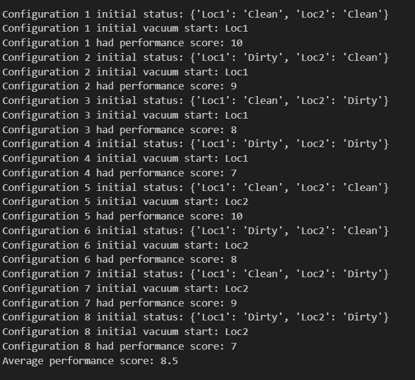

# Introduction to Artficial Intelligence

In this course I completed 5 major AI projects:
* I wrote an a simple reflex agent and an environment for it to complete
* I desgined a traveling sales person problem envrionment and produced a hill climbing and genetic algorithm to solve the puzzle
* I constructed a k-means clustering algorithm from scratch
* I built from scratch a logistic regression algorithm and implemented both the regularization and standardization methods
* I wrote a naive bayes classification algorithm for a spam filter and compared it to the sci-kit learn implementation

## Simple Reflex Agent and Vacuum Environment
All code for this project is in the python notebook "Vacuum_Reflex_Agent"

### Vacuum Environment
There are two locations or boxes an agent can be in, each box either has the status "dirty" or "clean"

### Simple Reflex Agent
An agent can perceive its current location and whether the location is dirty or not. It will then either clean the location if it is dirty or move to the opposite location if that location is clean.

### Results
 \
The performance score I used was -1 if the vacuum moved tiles, -1 if the vacuum cleans a tile and +10 if all the tiles are clean. This performance score best displays the true performance because it does not reward cleaning more squares and instead more effectively rewards completing the goal in a quick amount of time. 

##
