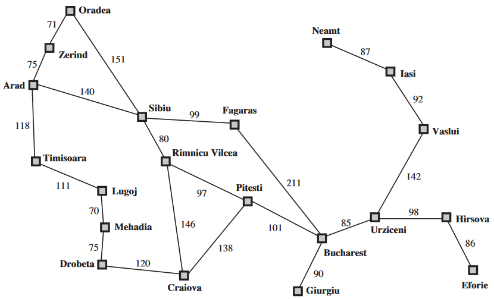
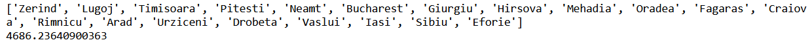
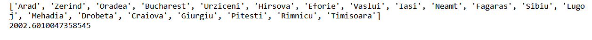

# Introduction to Artficial Intelligence

In this course I completed 5 major AI projects:
* I wrote an a simple reflex agent and an environment for it to complete [GoTo](#Simple-Reflex-Agent-and-Vacuum-Environment)
* I desgined a traveling sales person problem envrionment and produced a hill climbing and genetic algorithm to solve the puzzle
* I constructed a k-means clustering algorithm from scratch
* I built from scratch a logistic regression algorithm and implemented both the regularization and standardization methods
* I wrote a naive bayes classification algorithm for a spam filter and compared it to the sci-kit learn implementation

## Simple Reflex Agent and Vacuum Environment
All code for this project is in the python notebook [Vacuum Reflex Agent](Vaccum_Reflex_Agent.ipynb)

### Vacuum Environment
There are two locations or boxes an agent can be in, each box either has the status "dirty" or "clean".

### Simple Reflex Agent
An agent can perceive its current location and whether the location is dirty or not. It will then either clean the location if it is dirty or move to the opposite location if that location is clean.

### Results
 \
The performance score I used was -1 if the vacuum moved tiles, -1 if the vacuum cleans a tile and +10 if all the tiles are clean. This performance score best displays the true performance because it does not reward cleaning more squares and instead more effectively rewards completing the goal in a quick amount of time. 

## Hill Climbing and Genetic Algorithms for the Traveling Sales Person Problem
All code for the project is in the python notebook [Hill Climbing and Genetic](Hill_Climbing_And_Genetic_TSP.ipynb)

### Traveling Sales Person Environment
The Traveling Sales Person problem is the challenge of finding the shortest possible route for a sales person to visit every city on the map starting and ending at the same city. In this project I implemented a map of cities in Romania using a graph structure of nodes interconnected by edges with the cost of traversing an edge being the distance between two cities. The map is located here: \

### Hill Climbing Algorithm
The implemented hill climbing algorithm is a steepest ascent variation of the hill climbing optimization algorithm. This algorithm evaluates all the nearest neighbors from the current solution and will move in the direction of furthest improvement. A drawback of this method is that the algorithm can easily become stuck in a local maxima.

### Genetic Algorithm
The genetic algorithm is based on the ideas of natural selection from the natural world. This genetic algorithm uses a crossover and mutation function to simulate this process with the crossover function choosing which aspects of a parent solution are present in the child solution and the mutation function randomly choosing aspects of the parent solution to alter in the child solution.

### Results
#### Hill Climbing
 \
The output is the path the hill climbing implementation chose to solve the TSP and the performance cost. \
Unfortunately, the steepest ascent hill climbing algorithm got stuck in a local maxima and was unable to achieve the optimal solution.

#### Genetic
 \
Again, the output is the path the genetic algorithm took to solve the TSP and the performance cost. The performance of the genetic algorithm was much better than the hill climbing method as the genetic algorithm is more robust and less likely to get stuck in a local maxima than the hill climbing algorithm, so it found a far more optimal solution.

## K Means Clustering
All code for this project is in the python notebook [yada](yada.ipynb)

### Clustering Dataset
The dataset is located in the csv file [yada](yada.csv)
yada yada

### K Means Algorithm
yada yada

### Results
yada yada

## Logistic Regression
All code for this project is in the python notebook [yada](yada.ipynb)

### Regression Dataset
The dataset is located in the arff file [yada](yada.arff)
yada yada

### Logistic Regression Algorithm
yada yada

### Results
yada yada

## Naive Bayes
All code for this project is in the python notebook [yada](yada.ipynb)

### Spam Dataset
The datasets for this project are located in the csv files [yada](yada.csv) and [yada](yada.csv)

### Naive Bayes Algorithm
yada yada

### Results
yada yada

## Credit
Some of the projects completed here were inspired by the assignments in the textbook Articial Intelligence a Modern Approach by Stuart J Russell. \
Russell, Stuart J. (Stuart Jonathan), 1962-. Artificial Intelligence : a Modern Approach. Upper Saddle River, N.J. :Prentice Hall, 2010.
